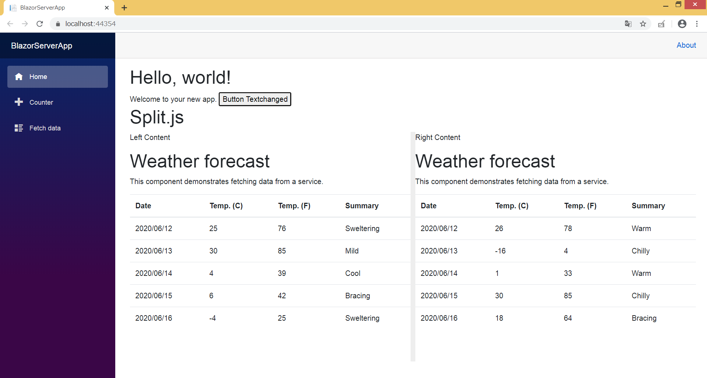
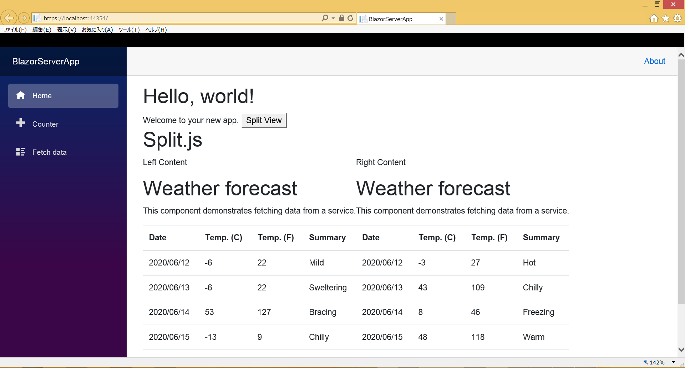

# BlazorSplitViewSample
- Blazorのサーバサイドサンプルをベースにsplit.jsを動作させているサンプルアプリです。

# 動作環境
- Visual Studio 2019
- Blazorサーバテンプレート
- SDK
  - Dotnet core SDK 3.1.300
- ブラウザ
  - Google Chrome
  - Microsoft Edge
  - Internet Explorer 11
  
# 動作結果
| **確認したブラウザ** | **動作の有無** | **動作画面** |
| ---- | ---- | ---- |
| Google Chrome | 〇 |  |
| Microsoft Edge | 〇 |  |
| Internet Explorer 11 | × |  |

# 参考Links
- [split.js公式](https://split.js.org/#get-started)
- [split.js公式 GitHub](https://github.com/nathancahill/split/tree/master/packages/splitjs#browser-support)
- [Blazor上でDOM検索を行う方法](https://www.syncfusion.com/faq/blazor/javascript-interop/is-there-a-way-to-access-dom-in-blazor)
  - split.jsをBlazorに適応する際に必要になった内容
- [split.js デモサンプル(ソースコードあり)](http://runstant.com/Kooh/projects/7573442b)
- [Vue.js/Blazor/Angularの文法比較サンプル集](https://qiita.com/yosgspec/items/3cf93e70a81805d70d29)
